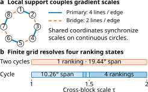
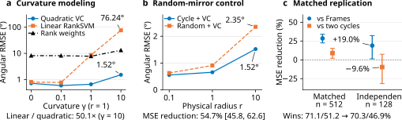

<div align="center">

# Structured Queries for Ordinal Gradient Recovery under Unknown Curvature

[](#quick-start)
[](#quick-start)
[](docs/reproduction.md#environment)
[](LICENSE)

**Design the queries. Observe their order. Recover the gradient direction.**

[🚀 Quick start](#quick-start) · [📊 Results](#paper-results) · [🔁 Reproduction](#reproduce-the-paper) · [📐 Method](docs/method.md)

</div>

## Overview

How much can a single ranking reveal about a local gradient when curvature is unknown?

This repository implements **structured, nonadaptive query designs** and **joint quadratic ranking decoders**. Coordinate-circle queries connect local directional information across coordinates. A finite construction uses **6d endpoints** and an exact **3d − 1 dimensional visible quadratic model**. The decoder receives query coordinates and their complete order; it never receives function-value gaps, gradients, or Hessians.

<p align="center">
  
</p>

- **Connected support.** Bridge queries synchronize component scales on continuous coordinate-circle support under the paper's genericity assumptions.
- **Curvature-aware recovery.** Analytic-center (AC) and volumetric-center (VC) solvers use the full ranking through an exact factorization of the physical quadratic kernel.
- **Consistency repair.** A dyadic soft quadratic fit handles incompatible rankings; the hybrid decoder preserves every successful hard solve.
- **Reproducible evidence.** Frozen synthetic inputs, target-level reference losses, figure data, and checksums accompany the implementation.

## Quick start

A CUDA-enabled PyTorch installation is required for query construction and numerical recovery. The release was checked with Python 3.12 and PyTorch 2.10. Install the package into your existing environment:

```bash
pip install -e '.[test]'
python examples/quickstart.py --device cuda:0
```

For your own ranking oracle:

```python
from connected_query_designs import make_queries, recover_direction

points = make_queries(dimension=20, radius=1.0, seed=7, device="cuda:0")
# points: [1, 120, 20]. Supply these offsets to your oracle in one batch.
order = oracle.rank(points)  # int64 [1, 120], lowest value first

estimate = recover_direction(points, order, method="quadratic-vc")
ascent_direction = estimate.direction  # float64 [1, 20], unit norm
```

`oracle.rank` above is your application-provided ranking interface. The [runnable example](examples/quickstart.py) includes a synthetic quadratic oracle. Use `-estimate.direction` for descent. Inputs remain on their CUDA device; no global dtype or device setting is changed by the package API.

### Choose a decoder

| Method | Information used | Output |
| :-- | :-- | :-- |
| `quadratic-vc` | Complete ranking, visible quadratic model | Volumetric-center direction |
| `quadratic-ac` | Complete ranking, visible quadratic model | Analytic-center direction |
| `hybrid-vc` | Complete ranking, with repair when required | Hard VC or repaired-ranking VC |
| `soft-quadratic` | Complete ranking, dyadic soft comparisons | Direct soft-fit direction |
| `linear` | Complete ranking, linear squared-hinge model | Calibrated RankSVM direction |
| `rank` | Complete ranking | Rank-weighted direction |
| `mirror-vc` | Antipodal signs | Linear volumetric-center direction |

The default linear and repair penalties are the paper's frozen values, `10⁴` and `10⁵`. Their loss normalizations differ; see [the method reference](docs/method.md). The `certified` flag describes numerical convergence and, for hard centers, consistency with the fitted order.

## Paper results

All angles below are in degrees. Experiments distinguish the effect of decoding, acquisition geometry, and connected-support information.

### Complete-ranking recovery

**768 independent quadratic targets**, dimensions 10/20/50, radii 0.1/1/10; pooled angular RMSE:

| Decoder | Structured cycle | Frames |
| :-- | --: | --: |
| Mirror-only VC | 22.69 | 19.72 |
| Rank weighting | 10.04 | 8.55 |
| **Joint quadratic VC** | **0.97** | **1.12** |

### Acquisition and finite resolution

| Comparison | Paper result | Evaluation population |
| :-- | :-- | :-- |
| Cycle vs random mirrored queries, same VC | **54.73% MSE reduction**, 95% CI [45.75%, 62.61%] | 192-target diagnostic subset |
| Cycle vs Frames, same VC | **19.00% MSE reduction**, 97.5% CI [1.44%, 32.22%] | 128 independent targets |
| Connected vs disconnected ambiguity pairs | **256/256 pairs separated**; median VC pair RMSE **4.38° vs 11.71°** | 256 theorem-aligned pairs |
| Hybrid recovery with 3% cubic remainder | **1.823° vs 7.841°** for rank weighting | 192 separate targets |

Acquisition comparisons use the same VC decoder and endpoint budget. The [complete replication results](results/paper/replication.csv) retain both Frames and two-cycle contrasts, with each population and confidence level identified.

<p align="center">
  
</p>

Exact values, population definitions, and aggregation rules: **[results and protocols](docs/reproduction.md)**.

## Reproduce the paper

The repository includes approximately 40 MB of compressed synthetic inputs and reference data. No dataset download or private server access is needed.

```bash
# Verify input/result checksums and reconstruct key paper numbers. CPU only.
python scripts/check_reference.py

# First GPU replay: eight frozen targets at d=10.
python scripts/reproduce.py curvature --dimension 10 --max-groups 1 \
  --device cuda:0 --output runs/curvature-smoke.jsonl

# Full experiments; each command writes a new result file.
python scripts/reproduce.py main          --output runs/main.jsonl
python scripts/reproduce.py curvature     --output runs/curvature.jsonl
python scripts/reproduce.py random-mirrors --output runs/random-mirrors.jsonl
python scripts/reproduce.py independent  --output runs/independent.jsonl
python scripts/reproduce.py ambiguity    --output runs/ambiguity.jsonl
python scripts/reproduce.py mismatch     --output runs/mismatch.jsonl

# Summarize replay output and compare overlapping target-level reference losses.
python scripts/summarize.py runs/curvature.jsonl

# Explore the paper's fixed scale family.
python examples/scale_resolution.py --device cuda:0

# Mathematical contracts and saved-result regression checks.
pytest -q
```

`--max-groups` is a smoke-test option. Omit it for full-cohort results. The runner supports explicit GPU selection and disjoint shards; [reproduction instructions](docs/reproduction.md#parallel-replay) give the commands. Original and independent populations remain separate in all reported comparisons.

## Repository map

```text
src/connected_query_designs/
  api.py             Query construction and permutation-only recovery API
  queries.py         Staggered coordinate-circle construction
  graphs.py          Coordinate support graphs and grid utilities
  features.py        Mirrored designs and exact quadratic feature factorization
  centers_ac.py      Analytic-center Newton solver
  centers_vc.py      Volumetric-center objective, derivatives, and Newton solver
  feasibility.py     Certified strictly feasible initialization
  decoders.py        Ranking controls and hybrid quadratic recovery
examples/            Runnable usage and scale-resolution examples
scripts/             Frozen-input replay, result checks, and aggregation
configs/paper.json   Manuscript experiment settings
results/paper/       Current manuscript tables and figure source data
data/                Frozen inputs, target-level reference losses, SHA-256 manifest
tests/               Focused numerical and data-integrity tests
```

## License

Released under the [MIT License](LICENSE).
